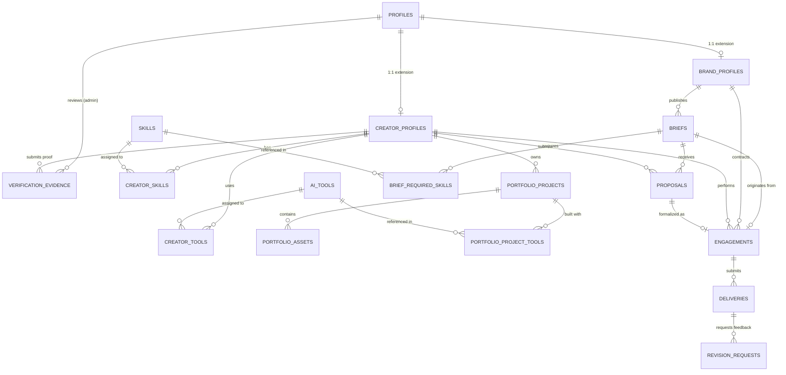

# CreatorProof AI — Database Architecture & Data Model

**Project**: CreatorProof AI — AI Content Creator Marketplace  
**Event**: ByteXL HackXlarate 2026  
**Status**: Production-ready Normalized PostgreSQL Architecture (17 Tables)

---

## 1. Architectural Overview & Design Principles

CreatorProof AI connects Enterprise Brands and Agencies with verified AI Content Creators. The database architecture is designed with the following core principles:

1. **Strict Tenant & Role Separation**: Multi-role identity system (`profiles`, `creator_profiles`, `brand_profiles`) linked 1:1 with Supabase Auth (`auth.users`).
2. **Normalized Taxonomy**: Independent skill and generative AI tool registries (`skills`, `ai_tools`) connected via M:N junction tables with proficiency levels.
3. **AI Workflow & Proof-of-Work Portfolios**: Granular metadata capturing model architectures, prompts, workflows, and commercial licensing rights.
4. **Draft-First Campaign Briefs**: Brand briefs support incremental drafting before requiring mandatory publication constraints (budget, content type, deadline).
5. **Contract Lifecycle without Payment Processing**: Formal proposals, engagements, deliveries, and revision tracking without financial transaction exposure.
6. **Integrity & Trust Guards**: Creator proof scores and verification statuses can never be modified by creators themselves; updates are strictly guarded by Row-Level Security and security-definer triggers.

---

## 2. Entity-Relationship Diagram (ERD)



---

## 3. Database Table Definitions & Relationships

### A. User Management

#### `public.profiles`
Base user identity table linked directly to `auth.users(id)`.
- **Primary Key**: `id UUID REFERENCES auth.users(id) ON DELETE CASCADE`
- **Fields**:
  - `email TEXT NOT NULL UNIQUE`: User email.
  - `role user_role NOT NULL DEFAULT 'creator'`: Enum (`creator`, `brand`, `agency`, `admin`).
  - `display_name TEXT`: User public display name.
  - `avatar_url TEXT`: Public avatar URL.
  - `bio TEXT`: Short biographical summary.
  - `created_at`, `updated_at TIMESTAMPTZ NOT NULL DEFAULT now()`.
- **Security Guard**: Database trigger `guard_profile_role` prevents ordinary users from modifying their own `role` column.

#### `public.creator_profiles`
Profile extension for creators offering generative AI production services.
- **Primary Key**: `id UUID DEFAULT gen_random_uuid()`
- **Foreign Key**: `profile_id UUID UNIQUE REFERENCES public.profiles(id) ON DELETE CASCADE`
- **Fields**:
  - `handle TEXT NOT NULL UNIQUE`: Creator slug/handle (e.g. `alex_flux`).
  - `tagline TEXT`: One-line value proposition.
  - `specialization TEXT NOT NULL`: Primary domain (e.g. `Generative VFX & 3D Motion`).
  - `availability availability_status NOT NULL DEFAULT 'available'`: Enum (`available`, `busy`, `not_available`).
  - `hourly_rate NUMERIC(10, 2) CHECK (hourly_rate IS NULL OR hourly_rate >= 0)`: Base rate.
  - `currency VARCHAR(3) NOT NULL DEFAULT 'USD'`: ISO 4217 code.
  - `experience_years INTEGER NOT NULL DEFAULT 1 CHECK (experience_years >= 0)`: Years in AI creative workflows.
  - `country TEXT`: Creator geographic region.
  - `proof_score INTEGER DEFAULT NULL CHECK (proof_score IS NULL OR (proof_score BETWEEN 0 AND 100))`: Score defaults to `NULL` until audited.
  - `is_verified BOOLEAN NOT NULL DEFAULT false`: Verification badge.
- **Security Guard**: Database trigger `guard_creator_trust` ensures only administrators or trusted backend processes can modify `proof_score` and `is_verified`.

#### `public.brand_profiles`
Profile extension for enterprises, agencies, and hiring brands.
- **Primary Key**: `id UUID DEFAULT gen_random_uuid()`
- **Foreign Key**: `profile_id UUID UNIQUE REFERENCES public.profiles(id) ON DELETE CASCADE`
- **Fields**:
  - `company_name TEXT NOT NULL`: Legal or registered business name.
  - `website TEXT`: Company domain.
  - `industry TEXT`: Industry vertical (e.g. `Gaming`, `Fintech`, `Consumer Tech`).
  - `company_size TEXT`: Organization tier (e.g. `1-10`, `11-50`, `51-200`, `201+`).
  - `is_verified BOOLEAN NOT NULL DEFAULT false`: Brand verification status.
  - `billing_email TEXT`: Invoicing notification address.

---

### B. Creator Capabilities & Taxonomies

#### `public.skills`
Master taxonomy for AI creative disciplines.
- **Primary Key**: `id UUID DEFAULT gen_random_uuid()`
- **Fields**: `name TEXT UNIQUE`, `slug TEXT UNIQUE`, `category TEXT`, `created_at`.

#### `public.ai_tools`
Master taxonomy for generative AI tools, models, and execution frameworks.
- **Primary Key**: `id UUID DEFAULT gen_random_uuid()`
- **Fields**: `name TEXT UNIQUE`, `slug TEXT UNIQUE`, `vendor TEXT`, `tool_type tool_type` (Enum: `image_generation`, `video_generation`, `audio_voice`, `llm_text`, `workflow_engine`).

#### `public.creator_skills` (M:N)
Junction linking creators to mastered skills.
- **Primary Key**: `id UUID DEFAULT gen_random_uuid()`
- **Foreign Keys**: `creator_profile_id REFERENCES creator_profiles(id) ON DELETE CASCADE`, `skill_id REFERENCES skills(id) ON DELETE CASCADE`
- **Fields**: `proficiency proficiency_level NOT NULL DEFAULT 'intermediate'` (Enum: `beginner`, `intermediate`, `expert`), `years_experience NUMERIC(3, 1) CHECK (years_experience >= 0)`.
- **Constraint**: `UNIQUE (creator_profile_id, skill_id)`.

#### `public.creator_tools` (M:N)
Junction linking creators to generative tools in their production stack.
- **Primary Key**: `id UUID DEFAULT gen_random_uuid()`
- **Foreign Keys**: `creator_profile_id REFERENCES creator_profiles(id) ON DELETE CASCADE`, `tool_id REFERENCES ai_tools(id) ON DELETE CASCADE`
- **Fields**: `proficiency proficiency_level NOT NULL DEFAULT 'intermediate'`.
- **Constraint**: `UNIQUE (creator_profile_id, tool_id)`.

---

### C. AI Portfolios & Asset Metadata

#### `public.portfolio_projects`
Individual showcase pieces detailing the AI generation pipeline.
- **Primary Key**: `id UUID DEFAULT gen_random_uuid()`
- **Foreign Key**: `creator_profile_id REFERENCES creator_profiles(id) ON DELETE CASCADE`
- **Fields**:
  - `title TEXT NOT NULL`, `slug TEXT NOT NULL`.
  - `description TEXT`: Creative context.
  - `content_type TEXT NOT NULL`: e.g. `Short-Form Video`, `Key Visuals`, `Billboard Campaign`.
  - `workflow_description TEXT`: Generation pipeline explanation (e.g. `Midjourney v6 base -> Magnific upscale -> Runway Gen-3 motion`).
  - `prompt_sample TEXT`: Sanitized prompt or style seed.
  - `models_used TEXT[] NOT NULL DEFAULT '{}'`: Array of models employed.
  - `is_commercial_licensed BOOLEAN NOT NULL DEFAULT false`: Whether client commercial rights were granted.
  - `license_type TEXT`: e.g. `Exclusive Commercial Buyout`, `Non-Exclusive Rights`.
  - `is_public BOOLEAN NOT NULL DEFAULT false`: **Defaults to private (`false`)** for creator privacy.
  - `completion_date DATE`.
- **Constraint**: `UNIQUE (creator_profile_id, slug)`.

#### `public.portfolio_assets`
Multi-format media files attached to a project.
- **Primary Key**: `id UUID DEFAULT gen_random_uuid()`
- **Foreign Key**: `project_id REFERENCES portfolio_projects(id) ON DELETE CASCADE`
- **Fields**:
  - `asset_url TEXT NOT NULL`, `thumbnail_url TEXT`.
  - `asset_type asset_media_type NOT NULL`: Enum (`image`, `video`, `audio`, `document`).
  - `mime_type TEXT NOT NULL`, `aspect_ratio TEXT` (e.g. `16:9`, `9:16`, `1:1`).
  - `resolution TEXT` (e.g. `3840x2160`), `duration_seconds NUMERIC(6, 2) CHECK (duration_seconds >= 0)`.
  - `file_size_bytes BIGINT CHECK (file_size_bytes >= 0)`.
  - `sort_order INTEGER NOT NULL DEFAULT 0`.

#### `public.portfolio_project_tools` (M:N)
Normalized relationship linking portfolio pieces to the AI tool registry.
- **Primary Key**: `id UUID DEFAULT gen_random_uuid()`
- **Foreign Keys**: `project_id REFERENCES portfolio_projects(id) ON DELETE CASCADE`, `tool_id REFERENCES ai_tools(id) ON DELETE CASCADE`.
- **Fields**: `role_in_project TEXT` (e.g. `Base Generation`, `Neural Upscaling`).
- **Constraint**: `UNIQUE (project_id, tool_id)`.

---

### D. Brand Creative Briefs

#### `public.briefs`
Campaign requirements published by brands to solicit creator pitches.
- **Primary Key**: `id UUID DEFAULT gen_random_uuid()`
- **Foreign Key**: `brand_profile_id REFERENCES brand_profiles(id) ON DELETE CASCADE`
- **Fields**:
  - `title TEXT NOT NULL`, `description TEXT NOT NULL`.
  - `style_aesthetic TEXT`: Creative direction (e.g. `Hyper-realistic Sci-Fi`, `Cinematic Documentary`).
  - `content_type TEXT`: Desired output format.
  - `duration_seconds NUMERIC(6, 2) CHECK (duration_seconds >= 0)`: Target run time.
  - `aspect_ratio TEXT`: Delivery aspect ratio (`9:16`, `16:9`, etc.).
  - `budget NUMERIC(10, 2) CHECK (budget IS NULL OR budget >= 0)`: Nullable during drafting.
  - `currency VARCHAR(3) NOT NULL DEFAULT 'USD'`.
  - `deadline TIMESTAMPTZ`.
  - `commercial_requirements TEXT`, `licensing_terms TEXT`.
  - `is_private BOOLEAN NOT NULL DEFAULT false`.
  - `status brief_status NOT NULL DEFAULT 'draft'`: **Defaults to `draft`**.
- **Constraint**:
  ```sql
  CONSTRAINT check_published_brief_fields CHECK (
      status != 'published' OR (
          budget IS NOT NULL AND
          content_type IS NOT NULL AND
          deadline IS NOT NULL
      )
  )
  ```

#### `public.brief_required_skills` (M:N)
Junction linking briefs to mandatory and optional skill requirements.
- **Primary Key**: `id UUID DEFAULT gen_random_uuid()`
- **Foreign Keys**: `brief_id REFERENCES briefs(id) ON DELETE CASCADE`, `skill_id REFERENCES skills(id) ON DELETE CASCADE`.
- **Fields**: `is_mandatory BOOLEAN NOT NULL DEFAULT true`.
- **Constraint**: `UNIQUE (brief_id, skill_id)`.

---

### E. Contract Collaboration (Non-Financial)

#### `public.proposals`
Creator pitches and budget quotes for brand briefs.
- **Primary Key**: `id UUID DEFAULT gen_random_uuid()`
- **Foreign Keys**: `brief_id REFERENCES briefs(id) ON DELETE CASCADE`, `creator_profile_id REFERENCES creator_profiles(id) ON DELETE CASCADE`.
- **Fields**: `pitch TEXT NOT NULL`, `proposed_budget NUMERIC(10, 2) NOT NULL CHECK (proposed_budget >= 0)`, `currency VARCHAR(3) NOT NULL DEFAULT 'USD'`, `estimated_delivery_days INTEGER NOT NULL DEFAULT 5 CHECK (estimated_delivery_days > 0)`, `status proposal_status NOT NULL DEFAULT 'submitted'`.
- **Constraint**: `UNIQUE (brief_id, creator_profile_id)`.

#### `public.engagements`
Formal agreements between brand and creator.
- **Primary Key**: `id UUID DEFAULT gen_random_uuid()`
- **Foreign Keys**: `brief_id REFERENCES briefs(id) ON DELETE SET NULL`, `brand_profile_id REFERENCES brand_profiles(id) ON DELETE RESTRICT`, `creator_profile_id REFERENCES creator_profiles(id) ON DELETE RESTRICT`, `proposal_id REFERENCES proposals(id) ON DELETE SET NULL`.
- **Fields**: `agreed_amount NUMERIC(10, 2) NOT NULL CHECK (agreed_amount >= 0)`, `currency VARCHAR(3) NOT NULL DEFAULT 'USD'`, `terms TEXT`, `status engagement_status NOT NULL DEFAULT 'pending'`, `start_date TIMESTAMPTZ NOT NULL DEFAULT now()`, `due_date TIMESTAMPTZ`, `completed_at TIMESTAMPTZ`.

#### `public.deliveries`
Asset drop submissions from the creator for review.
- **Primary Key**: `id UUID DEFAULT gen_random_uuid()`
- **Foreign Keys**: `engagement_id REFERENCES engagements(id) ON DELETE CASCADE`, `creator_profile_id REFERENCES creator_profiles(id) ON DELETE RESTRICT`.
- **Fields**: `version_number INTEGER NOT NULL DEFAULT 1 CHECK (version_number >= 1)`, `notes TEXT`, `asset_urls TEXT[] NOT NULL DEFAULT '{}'`, `status delivery_status NOT NULL DEFAULT 'submitted'`, `submitted_at TIMESTAMPTZ NOT NULL DEFAULT now()`, `reviewed_at TIMESTAMPTZ`.

#### `public.revision_requests`
Specific revision notes and requested adjustments from the brand.
- **Primary Key**: `id UUID DEFAULT gen_random_uuid()`
- **Foreign Keys**: `delivery_id REFERENCES deliveries(id) ON DELETE CASCADE`, `brand_profile_id REFERENCES brand_profiles(id) ON DELETE RESTRICT`.
- **Fields**: `feedback TEXT NOT NULL`, `requested_changes JSONB NOT NULL DEFAULT '[]'::jsonb`, `status revision_status NOT NULL DEFAULT 'open'`, `created_at TIMESTAMPTZ NOT NULL DEFAULT now()`, `resolved_at TIMESTAMPTZ`.

---

### F. Creator Trust & Verification

#### `public.verification_evidence`
Audit trails, third-party platform API metrics, and SHA-256 hashes verifying authentic work.
- **Primary Key**: `id UUID DEFAULT gen_random_uuid()`
- **Foreign Key**: `creator_profile_id REFERENCES creator_profiles(id) ON DELETE CASCADE`
- **Fields**:
  - `evidence_type TEXT NOT NULL`: e.g. `Platform API Metric`, `Workflow Screen Recording`, `Client Attribution`.
  - `provider TEXT`: e.g. `YouTube`, `TikTok`, `Instagram`, `ArtStation`.
  - `external_id TEXT`: Third-party asset or channel ID.
  - `evidence_data JSONB NOT NULL DEFAULT '{}'::jsonb`: Raw metrics payload.
  - `proof_hash TEXT`: SHA-256 hash of original output file.
  - `status verification_status NOT NULL DEFAULT 'pending'`: Enum (`pending`, `approved`, `rejected`).
  - `reviewed_by UUID REFERENCES profiles(id) ON DELETE SET NULL`: Administrator ID.
  - `review_notes TEXT`.
  - `submitted_at TIMESTAMPTZ NOT NULL DEFAULT now()`, `reviewed_at TIMESTAMPTZ`.
- **Security Rule**: Creators can only insert records in `pending` status. Only platform administrators can transition status to `approved` or `rejected`.

---

## 4. Row-Level Security (RLS) Matrix

| Table | SELECT | INSERT | UPDATE | DELETE |
| :--- | :--- | :--- | :--- | :--- |
| `profiles` | Public | Self (`auth.uid() = id`, non-admin) | Self or Admin (cannot escalate role) | Admin |
| `creator_profiles` | Public discovery | Self (`is_verified = false`, `proof_score = NULL`) | Self or Admin (cannot escalate trust fields) | Self or Admin |
| `brand_profiles` | Public discovery | Self (`is_verified = false`) | Self or Admin | Self or Admin |
| `skills` / `ai_tools` | Public | Admin only | Admin only | Admin only |
| `creator_skills` / `tools` | Public | Creator owner | Creator owner | Creator owner |
| `portfolio_projects` | Public if `is_public = true` OR creator owner OR admin | Creator owner | Creator owner | Creator owner |
| `portfolio_assets` | Public if parent project is public OR creator owner | Creator owner | Creator owner | Creator owner |
| `portfolio_project_tools` | Public if parent project is public OR creator owner | Creator owner | Creator owner | Creator owner |
| `briefs` | Public if `published` and NOT `is_private` OR brand owner | Brand owner | Brand owner | Brand owner |
| `brief_required_skills` | Public if brief is public OR brand owner | Brand owner | Brand owner | Brand owner |
| `proposals` | Proposal creator OR owning brand of brief | Creator (`status = 'submitted'`) | Creator (if submitted) OR Brand (status) | Creator (if submitted) |
| `engagements` | Participating brand OR creator | Brand | Participating parties | Admin only |
| `deliveries` | Participating brand OR creator | Engagement creator | Creator (if submitted) OR Brand (review) | Creator (if submitted) |
| `revision_requests`| Participating brand OR creator | Engagement brand | Engagement brand OR creator | Engagement brand |
| `verification_evidence` | Creator owner OR Admin | Creator (`status = 'pending'`) | **Admin only** (creator cannot approve self) | Creator (if pending) |

---

## 5. Teammate AI Integration Field Mapping

Your teammate building Gemini AI Brief Builder, Creator Matching, and Portfolio Metadata Assistance should integrate with these exact database fields:

| AI Module | Primary Tables | Consumed Fields | Produced Fields |
| :--- | :--- | :--- | :--- |
| **AI Brief Builder** | `briefs`, `brief_required_skills`, `skills` | User raw prompt / objective | `title`, `description`, `style_aesthetic`, `content_type`, `duration_seconds`, `aspect_ratio`, `budget`, `brief_required_skills` mappings. |
| **Creator Matching Engine** | `creator_profiles`, `creator_skills`, `creator_tools`, `briefs`, `brief_required_skills` | `brief.style_aesthetic`, `brief.content_type`, `brief.duration_seconds`, `brief_required_skills` | Compares against `creator_profiles.specialization`, `creator_skills`, `creator_tools`, `creator_profiles.proof_score`, and availability. |
| **Intelligent Search** | `creator_profiles`, `portfolio_projects`, `skills`, `ai_tools` | Search query tokens | Semantic match on `creator_profiles.specialization`, `portfolio_projects.workflow_description`, `portfolio_projects.models_used`, and `skills.name`. |
| **Portfolio Metadata Assistant** | `portfolio_projects`, `portfolio_project_tools` | Uploaded media, user workflow notes | Synthesizes `workflow_description`, extracts `prompt_sample`, populates `models_used` array, and suggests `license_type`. |

---

## 6. Migration Execution Instructions

### Option 1: Via Supabase CLI (Local Development)
```bash
# 1. Reset or apply migrations sequentially
npx supabase db reset

# Or push directly to remote linked project:
npx supabase db push
```

### Option 2: Via Supabase Dashboard (Hosted Project)
1. Open your Supabase project dashboard: [https://supabase.com/dashboard](https://supabase.com/dashboard)
2. Navigate to the **SQL Editor** tab.
3. Execute the migration scripts in strict sequence:
   - Run `supabase/migrations/001_schema.sql` (Creates types, tables, and constraints).
   - Run `supabase/migrations/002_policies.sql` (Enables RLS, security functions, and policies).
   - Run `supabase/migrations/003_indexes.sql` (Creates performance and discovery indexes).
   - Run `supabase/seed.sql` (Seeds 20 skills and 15 AI tools lookup data).
4. *(Optional Local Auth Seeding)*: In local environment with `SUPABASE_SERVICE_ROLE_KEY` set, run:
   ```bash
   npx tsx scripts/seed-local-auth.ts
   ```
